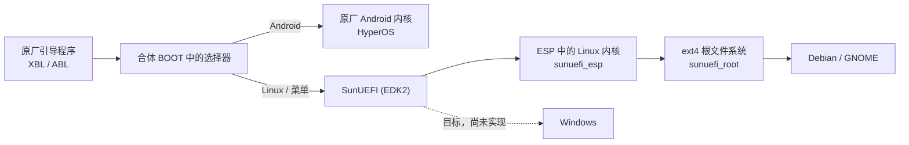

# Project SunUEFI

小米平板 8 Pro（代号 `piano`，骁龙 8 至尊版 / SM8750）的统一 UEFI 与 Linux 适配项目。

平板的原厂 Android 保持不动。SunUEFI 在它旁边加入一套开源 UEFI（EDK2），让同一块平板可以从内部存储直接启动 Debian 和 GNOME，不需要每次接电脑。项目的长期目标是通过这一套 UEFI，在这台平板上获得完整的 Linux 与 Windows 使用体验；Linux 已经能日常操作，Windows 还没有启动过。

## 现在能做什么

从内部磁盘启动的 Debian 13 / GNOME 已经可以：

* 用 Adreno GPU 加速绘制桌面，屏幕以 3200×2136、144 Hz 显示，可以手动调亮度。
* 用手指点按、拖动窗口、长按弹出菜单和使用手势。
* 接上官方磁吸键盘打字、使用触控板，键盘背光可以通过 GNOME 的标准选项调节。
* 使用 Wi-Fi 和蓝牙。
* 用四个扬声器播放声音，并用 GNOME 夜灯调整屏幕色温。
* 打开前后相机预览并录像。
* 使用默认中文界面、拼音输入法和 Chromium 浏览器，GNOME 动画默认开启。
* 在 Linux 和原厂 Android 之间来回切换。

目前最影响使用的是：启动到桌面通常需要一到两分钟，途中可能长时间灰屏或白屏，缺少清楚的进度提示；切换刷新率、关屏或合盖之后，屏幕可能黑屏而背光仍亮，需要重启。完整列表见下文[功能与已知问题](#功能与已知问题)。

## 开机时发生什么

平板最早的启动阶段仍由小米原厂的引导程序（XBL 和 ABL）完成，我们没有替换它们。SunUEFI 放进的是 Android 的 BOOT 分区：在原厂 Android 内核前面加一个很小的“选择器”，再把同一份 SunUEFI 核心附在后面。这个组合叫**合体 BOOT**。



选择器读取一条保存好的“下次走哪条路”。Android 路线直接把控制权交给原厂内核，不会先运行 UEFI；Linux 或菜单路线才进入完整的 UEFI。Linux 的内核放在一个小的 FAT32 分区 `sunuefi_esp` 中（ESP，EFI 系统分区，UEFI 约定存放启动文件的分区），系统和应用放在单独的 ext4 分区 `sunuefi_root`，所以不需要每次把整个桌面解压到内存。

### 启动路线会被记住

选择保存在合体 BOOT 自己的一小块记录区里，由项目工具读写，不依赖 PMIC 寄存器。普通重启会沿用上一次的选择；没有有效记录时默认进入 Android。目前已经能用的是：

* 在 Android 一侧保存路线，重启后进入 Linux。
* 在 Linux 里执行 `piano-next-boot android --reboot` 回到 Android。
* 用 Android 标准的 `reboot recovery` 进入小米原厂 Recovery，不改动已保存的路线。

还没有做的是：自动记住 UEFI 菜单里的每一次选择、一次性请求用完后自动清除，以及和系统更新（OTA）配合的 Root 模块。细节见[启动状态与切换](docs/devel/reboot-request.md)和[Linux 下次启动入口](docs/devel/linux-next-boot.md)。

### UEFI 里的 Fastboot

SunUEFI 运行时在后台提供一个 USB Fastboot 服务，设备名为 `SunUEFI-piano`。它用来调试：即使屏幕没有画面，也能从电脑读取日志、导出屏幕截图、只读读取分区内容，或请求启动已安装的 Linux。

它和另外两个容易混淆的东西不同：

| 名称 | 什么时候出现 | 能做什么 |
| --- | --- | --- |
| 原厂 Bootloader Fastboot | 开机时按键进入，或 `adb reboot bootloader` | 小米原厂功能，可刷写分区 |
| UEFI Fastboot（本项目） | SunUEFI 运行期间 | 日志、截图、只读读取、请求启动；不支持刷写和擦除 |
| Linux 的 USB 网络 / SSH | Linux 启动之后 | 普通的 Linux 远程登录与调试 |

交接给 Linux 时 UEFI Fastboot 就会退出。从冷启动的合体 BOOT 进入时，USB 初始化曾经超时，所有后台场景也还没有走通，所以现在不能依赖它。命令见 [UEFI Fastboot](docs/user/fastboot.md)。

### 同一个核心

项目只维护一套 UEFI 核心和一套产品镜像 `PianoUEFI-product.img`。合体 BOOT、临时的 `fastboot boot` 启动、安装器用到的都是同一份核心，不再按功能拆成多套测试镜像。

## 功能与已知问题

当前运行使用 CSOT 面板配置，选择方式见[面板选择](docs/devel/panel-selection.md)。

### 可以使用

| 功能 | 说明 |
| --- | --- |
| 磁盘启动 Linux | 从合体 BOOT 经 UEFI 进入内部 ESP 和 ext4 系统，普通重启沿用选择 |
| 返回原厂 Android | Android 路线直通，Linux 里可以一条命令切回 |
| GNOME 桌面与 GPU 加速 | 原生双 DSI 显示、Adreno 加速 |
| 屏幕显示与亮度 | 3200×2136、144 Hz 初始显示，手动亮度 |
| 触屏 | 点按、拖动、长按、手势，报告速率约 144 Hz |
| 官方键盘与触控板 | 打字、指针、点击、键盘背光 |
| Wi-Fi | 扫描并联网 |
| 蓝牙 | 可用 |
| 四扬声器 | 沿用原厂功放增益，音量可调 |
| 夜灯 | GNOME 夜灯调整色温 |
| 前后相机 | 预览和录像；画质问题见下表 |
| 电池与充电状态 | 双电池、基础 PD 充电和 UPower 状态 |
| 默认桌面 | 中文界面、拼音输入法、Chromium 浏览器，GNOME 动画开启 |

### 可以使用，但有问题

| 功能 | 能做到什么 | 现存问题 |
| --- | --- | --- |
| 144 Hz 显示 | 初始即 144 Hz | 切换 60 / 120 Hz，或关屏、合盖后恢复，可能黑屏、背光仍亮 |
| 相机 | 前后摄像头预览与录像，走高通 CAMSS/TFE 硬件 ISP，3A（自动曝光 / 对焦 / 白平衡）由软件实现 | 首帧、曝光、对焦和画质仍在改善，与原厂有差距；完整专业模式尚未提供 |
| 麦克风 | 录音、回放，原生单声道输入 | 底噪和桌面输入电平仍需调校 |
| 传感器 | 加速度、光线、罗盘、距离等数据可读，并接入标准的 SensorProxy | 自动旋转、自动亮度曲线等桌面联动还在完善；陀螺仪等数据的单位和标准接口未全部完成 |
| 电源 | 充电状态、基础 PD 充电 | 关机偶尔回到 Android，原因未知；合盖和电源键目前只处理背光 |
| 启动时间 | 能从内部 ext4 启动到桌面 | 通常需要一到两分钟，启动过程中可能灰屏或白屏、没有进度提示；首次启动可能更久 |
| UEFI 菜单 / Setup / Shell | 中文菜单和实体按键可用 | 集成版本的物理屏幕白屏（截图内容正确）；UEFI 阶段触屏和键盘不可用。进入 Linux 后屏幕恢复正常 |
| UEFI Fastboot | 日志、截图、只读读取 | 冷启动 USB 初始化曾超时，部分后台场景未走通 |
| 闪光灯 / RGB 灯 / 红外 | 闪光灯的标准 LED 接口已注册；RGB 灯接口已出现 | 闪光灯实际发光未观察；红外发射未验证 |

### 尚未完成

* **触控笔**：定位与压感绘画已实现，当前需要以 120 Hz 启动；144 Hz 笔输入、完整掌压处理、快捷手势、震动和无线充电仍在完善。运行中切换刷新率仍可能黑屏。
* **睡眠**：锁屏、待机、休眠没有完成。
* **HDR、12-bit 色深、可变刷新率**：还在适配，不能作为可用功能。
* **指纹**：原厂安全通路已定位，Linux 端没有实现。
* **Windows / WinPE**：目标，尚未启动。

更详细的现状和设备记录见[项目状态](docs/status.md)，用户可见的问题和绕过办法见[已知问题](docs/user/known-issues.md)。

## 开始使用

目前没有公开的 Release 下载页。构建产物来自 GitHub Actions 的 **Build products** 工作流，你也可以自己构建。固件和原厂提取材料的再分发许可还在核对，核对完成前不会提供二进制 Release。

### 你需要

* 小米平板 8 Pro，Bootloader 已解锁，Android 已 root 并开启 USB 调试。
* 电脑安装 Python 3.10 或更高版本、Android platform-tools（`adb`、`fastboot`）。
* 一块已划好 `sunuefi_esp`（512 MiB，FAT32）和 `sunuefi_root`（约 63.5 GiB，ext4）的平板。**全新平板的首次分区还不能由安装器完成。**
* 先备份个人数据。

### 安装

1. 在工作流里选择 `debian-gnome` 目标（`uefi` 和 `linux` 目标不含完整系统），下载 `piano-debian-gnome-提交号` 并解压。
2. 用 `adb devices -l` 找到平板在 Android 下的序列号，然后运行：

   ```sh
   sh install.sh inspect --serial 序列号 --output inspect.json
   sh install.sh plan --serial 序列号 --output update-plan.json
   sh install.sh apply --serial 序列号 --plan update-plan.json
   ```

   Windows 把 `sh install.sh` 换成 `install.cmd`。这三条命令只读取和核对，不写入。
3. 确认计划后加 `--execute` 才会真正更新 ESP 和 root：

   ```sh
   sh install.sh apply --serial 序列号 --plan update-plan.json --execute
   ```

安装器的完整说明见[下载包中的安装入口](docs/user/install-from-artifact.md)。

合体 BOOT 还没有集成到安装器，Android 端的 KernelSU / Magisk 模块（含 WebUI）也还没有可安装的 ZIP。合体 BOOT 目前由维护者用 `./build.sh trampoline` 和 `./build.sh boot-repack` 生成并写入 BOOT 分区，步骤和限制见[原生 BOOT 重打包](docs/devel/android-boot-repack.md)。不想改动 BOOT 的话，可以按[快速体验](docs/user/getting-started.md)用 `fastboot boot` 临时加载固件，重启后即恢复。

### 回到 Android

* 在 Linux 里运行 `piano-next-boot android --reboot`。
* 屏幕停在原厂 Fastboot 界面：`fastboot reboot`。
* 电脑能看到 `SunUEFI-piano`：`fastboot -s SunUEFI-piano reboot`。
* 完全没有反应：长按电源键强制重启。

更多情况见[返回 Android 与故障恢复](docs/user/recovery.md)。

## 自己构建

先取得固定版本的上游源码，再在构建容器里生成 UEFI 和安装工具包：

```sh
./build.sh sources
docker build -t sunuefi-builder -f containers/Dockerfile .
docker run --rm -v "$PWD:/workspace" -w /workspace sunuefi-builder bash -euc '
  git config --global --add safe.directory /workspace
  git config --global --add safe.directory "/workspace/*"
  python3 -m venv .venv
  source .venv/bin/activate
  python -m pip install -r requirements-build.txt
  ./build.sh uefi
  ./build.sh installer --product artifacts/product/PianoUEFI-product.img --output artifacts/installer-uefi
'
```

完整的 Debian / GNOME 系统包需要 ARM64 构建机，以及允许 chroot 的 `--privileged` 容器，依次运行 `./build.sh linux`、`mesa`、`sensors`、`release-rootfs`、`package`、`installer`。检查可以不连接平板：`./build.sh check`。完整流程、输入材料和各步骤的输出位置见[构建手册](docs/devel/building.md)与[公开构建链](docs/devel/public-build.md)。

## 项目站在哪些项目之上

SunUEFI 不是从零重写所有东西。上游源码保持固定版本放在 `upstream/`，我们自己的修改放在 `patches/`、`uefi/`、`linux/` 和构建工具里。

| 项目 | 负责什么 | 我们在上面做了什么 |
| --- | --- | --- |
| [TianoCore EDK2](https://github.com/tianocore/edk2) / [Mu-Silicium](https://github.com/Project-Silicium/Mu-Silicium) | UEFI 基础代码和高通平台集成 | Piano 平台、启动交接、存储、输入、显示继承、UEFI Fastboot，以及对原厂分区的只读保护和安全退出 |
| [simple-init](https://github.com/BigfootACA/simple-init) | UEFI 里的图形启动菜单 | 平板布局、中文、实体按键，以及和固件后台服务的联动 |
| [linux-piano](https://github.com/blu-sharky/linux-piano) | SM8750 内核、设备树和板级驱动基线 | 合入稳定版内核，修正内存 / DMA、显示、音频等 |
| [debian-piano](https://github.com/blu-sharky/debian-piano) | Debian 根系统构建、设备服务、相机和输入辅助程序 | 专用 ESP / root、多发行版 BSP（板级配置包）、统一打包 |
| [piano-firmware](https://github.com/blu-sharky/piano-firmware) | Wi-Fi、蓝牙、DSP、触控等设备固件和功放预设 | 按来源装入系统；设备参数从本机原厂数据读取。它不是整套 HyperOS，也不含原厂相机算法 |
| [piano-mesa](https://github.com/blu-sharky/piano-mesa) | Adreno 图形用户空间 | 与内核和根系统配套的 Mesa 软件包 |
| [piano-sensors](https://github.com/blu-sharky/piano-sensors) | 高通传感器（SSC）通信与桌面桥接 | 数据类型、读取接口、标准 SensorProxy 与自动亮度策略 |
| [MiCode](https://github.com/MiCode) 与本机 HyperOS | 原厂设备树、驱动、配置的参照 | 对照真实命令、时序和参数，按标准接口移植 |

内核之外的 Debian 软件仍通过标准 APT 安装。除 Debian / GNOME 之外，仓库里还有 Ubuntu、Arch、KDE 等目标的配置，但只有 Debian / GNOME 完整走通过，其他目标没有验证。

## 文档

* [快速体验](docs/user/getting-started.md)、[安装入口](docs/user/install-from-artifact.md)、[返回 Android](docs/user/recovery.md)、[UEFI Fastboot](docs/user/fastboot.md)、[已知问题](docs/user/known-issues.md)
* [项目状态](docs/status.md)：功能和设备记录
* [文档导航](docs/README.md)：开发、专题和历史记录
* [第三方来源](THIRD_PARTY.md)、[许可](LICENSE.md)、[贡献指南](CONTRIBUTING.md)、[AI 协作规范](AGENTS.md)
